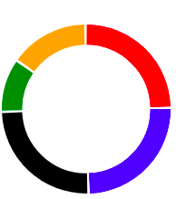

# Simple Donuts

A Small Library for creating donut charts.


## Very small
The Library has a minified Size of 4.144 KiB.


## Simple Usage

```js
const { Donut } = winodw.SimpleDonuts

const donut = new Donut({ 
       entries: [
           {
               color: 'red',
               value: 0.25,
           },
           {
               color: 'blue',
               value: 0.25,
           },
           {
               color: 'black',
               value: 0.25,
           },
           {
               color: 'green',
               value: 0.1,
           },
           {
               color: 'orange',
               value: 0.15,
           }
       ], 
       thickness: 12,
       spacing: 0.005
   })
   
const svgElement = donut.getSVGElement()

document.getElmentById('parent_element').appendChild(svgElement)
```


